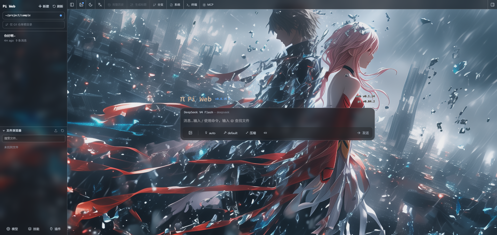
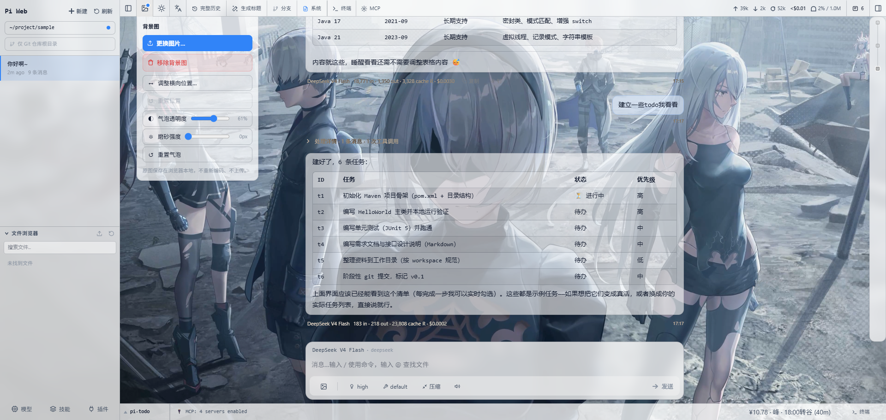
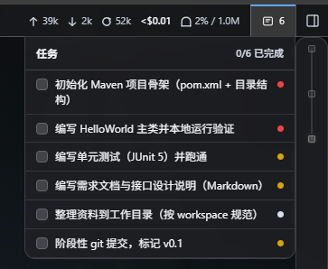
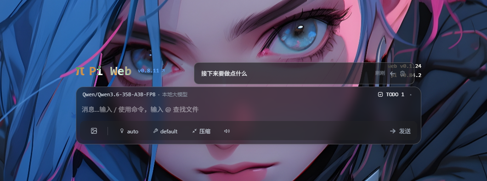

# Pi Web — Sky 皮肤版（@baique/pi-web-sky）

[](https://www.npmjs.com/package/@baique/pi-web-sky)

> 本项目是 [pi-web](https://github.com/earendil-works/pi)（经 [@agegr/pi-web](https://github.com/agegr/pi-web) 二次开发）的独立发行版，MIT 协议。
> 与 pi 原生发行版共用本机配置与会话文件——浏览器里的界面，pi 内核与全部 `~/.pi/agent` 数据照旧。

[pi 编程智能体](https://github.com/earendil-works/pi) 的本地浏览器界面：查找与继续会话、运行智能体、配置模型与资源、浏览项目文件。基于上游分叉，在原生 pi-web 之上重做了视觉与交互，并持续将上游高价值 PR 手工移植回来（见 [文档](docs/upstream-ports.md)）。

**当前跟踪上游版本：0.8.11**

## 预览

**首页**


**深色首页**



**终端功能**


**消息钉**


**浅色首页**



**AI TODO**



**用户TODO**



## 快速开始

需要 Node.js 22.19+，一行起服（默认打开浏览器，地址 `127.0.0.1:30143`）：

```bash
npx @baique/pi-web-sky@latest
```

全局安装：

```bash
npm install -g @baique/pi-web-sky@latest
pi-web-sky
# 更新：重启进程后重跑同样命令即可；卸载：npm uninstall -g @baique/pi-web-sky
```

首次使用先在 **Models** 面板登录或配置 API Key。默认仅监听 `127.0.0.1`；对外暴露意味着授权该进程执行高权限操作，请务必通过 `PI_WEB_PASSWORD` 开启 Basic Auth 并在 HTTPS/VPN 内网使用。

## 我们做了什么

以下是我们相对原生 pi-web 的主要工作（截图为实机效果，图随文走）。

### 玻璃感 UI

整站视觉重做为统一的毛玻璃体系——消息气泡、Composer 输入区、工具栏、侧边栏、todo 面板、悬浮面板与时间轴全部同款 frosted-glass，壁纸可透出。气泡与面板的模糊/饱和度按浅深主题分离调校（如浅色 `blur 12px + saturate 80%`、深色 `140%`），边框改为半透明文字色混合，消除壁纸上刺眼的纯白/纯黑描边。

底层收敛为分层玻璃 token（`--bubble-*` 层级体系）与标准玻璃 class（`glass-top-panel/panel/popover`），组件不再散落硬编码 px/rgba；修复了 `backdrop-filter` 被根容器 z-index 截断导致毛玻璃失效、模型下拉被 containing block 劫持错位等坑。

### 内置多会话终端

面板内置 xterm.js 终端，两栏布局——左侧只放当前项目的终端，右侧按下拉分组列出所有项目的终端；打开面板或切换项目时当前项目没有终端会自动补开一个，命名 `<项目名>-<4位随机>`。服务端 pty + SSE 流式输出，多会话并行，刷新页面后会话保留；后台重启后失联终端会标记并支持一键清理。配色随浅深主题切换，玻璃质感与消息气泡同源。

### 背景图设置

图片/视频壁纸，支持横向拖动调整位置、平铺重复、边缘色彩填充缝隙、一键重置位置。背景设置里另有两支滑块，可分别调节消息气泡的**透明度与磨砂强度**，刷新后保留——喜欢厚磨砂还是近透明的玻璃，随手可调。

### 会话看板（任务即看板）

画布式会话工作台：会话以卡片铺在无限画布上，可拖拽排版、连线、随手写便笺；**卡片即工作台**——展开卡片直接在画布上聊天、看状态、盯统计，不必离开看板。

- **任务即看板**：任务本身就是看板——点任务行直接打开它的看板，任务内的会话自动成卡、新会话自动补卡不遮挡，旧卡片坐标持久化、刷新不丢；任务改名看板同步改名，删任务连带删看板。任务看板是任务会话的实时镜像，不混入手动看板列表（任务行本身即入口）。
- **卡片两态**：收合卡显示状态/标题/最后回复，展开即工作台（消息区 + 输入区 + 底栏通知/额度/统计），展开后仍可拖动、拉伸、连线。
- **状态系统**：卡片实时显示思考中/执行工具/等待输入等状态（思考球动效），系统「运行中」看板跨项目自动聚合所有正在运行的会话。
- **便笺**：自研 markdown 便笺（毛玻璃气泡），支持颜色、等比缩放、代码块，替代 tldraw 内置便笺。
- **画布打磨**：无限画布缩放/平移/吸附对齐、重叠卡片点击置顶、scrim 磨砂背景调节（右上角滑块）、Ctrl+F 看板内定位节点。
- 看板 URL 持久化（`?board=`），刷新后停留在同一张看板。

### 消息体验细节

- **从此处编辑对齐 pi 语义**：回滚目标改为取会话树上的真实 parent，任意用户消息（会话首条、压缩后的消息、连续用户消息）都可编辑回滚——首条回滚到会话起点，与 pi 的 `navigateTree` 行为一致；顺带修复了"首条消息无法新建会话"以及该路径下会话文件不落盘的缺陷。
- **消息钉**：把任意消息气泡钉成置顶浮窗，可全局拖拽、自由缩放，关键上下文边干活边看。
- **AI 消息元信息工具栏**：模型名/字数/统计/复制/钉/时间下沉为气泡外底部工具栏，长文阅读不被头部遮挡。
- **todo 面板**：composer 顶栏 TODO 徽标与右上角窄面板实时展示会话 pi-todo 状态。
- **瞬时通知**：扩展/错误的临时提示由底部 widget shelf 就地显示、自动消退（移动端顶部居中堆叠）；agent 运行状态经 composer 顶栏播报槽播报。

### 输入框草稿暂存区

输入内容随时 `Ctrl+S` 暂存、`Ctrl+Delete` 删除，跨会话持久，意外清空输入框也不慌；回填与正在输入的内容做冲突保护。Composer 重构为整体玻璃面板，草稿、输入框、工具条合一。

### thinking-orbs 思考球

集成 [thinking-orbs](https://www.npmjs.com/package/thinking-orbs)（MIT）：等待模型、执行工具的状态行与思考块加载态统一换成呼吸/工作动画球，浅色主题下单独做对比度修正。思考块展示改为**纯文本注记**——零背景零边框、仅左侧一条细线标识思考区，长文阅读更舒服；消息气泡材质统一收敛为冒泡层级 token 体系。

### 移植上游修复（含自研补丁）

上游 PR 无法直接 merge（本仓库皮肤改造面大），以手工移植为主，全部经浏览器 e2e 验证：

- **#519** 关闭技能开关把 SKILL.md 写坏（`false` 被当不存在致重复 key）
- **#590** 大图上传压缩 + 渲染 toolResult 图片
- **#517** 内置斜杠命令一次回车直接执行
- **#536** 文件管理器复制/粘贴路径
- **#587** 会话历史分页加载 + BranchNavigator 递归爆栈修复（额外补了服务端 `hasMore` 标记，修掉上游"折叠块导致上翻入口消失"的偏差）
- **#516** 打开单个会话不再全量扫目录（7ms vs 322ms）
- **#544** Origin 校验容忍 Chromium 剥端口（修复 403 白屏）
- **#520** 内联 SVG 预览加 script 拦截 CSP
- **#470** MCP 服务器管理面板（全局与项目 `mcp.json`，含连通性测试）

### 安全与性能

- 流式文件响应统一 `X-Content-Type-Options: nosniff`；SVG 预览附加严格 CSP（`default-src 'none'` 等）与 `Referrer-Policy`，恶意 SVG 的脚本无法在本站点执行
- API Origin 校验只比较 hostname（容忍端口变化），host 白名单继续拦截 DNS rebinding 与跨 loopback 攻击
- **会话加载提速**：打开会话/定位会话文件只读取每个 JSONL 的首行 header（校验 id、取标题），不再整文件解析；会话列表扫描去重（并发请求合流）、缓存 TTL 30s → 5min，再消除 StrictMode 双发扫描——首开明显变快

## 开发

```bash
npm install
npm run dev          # http://127.0.0.1:30143
node_modules/.bin/tsc --noEmit
npm run lint
npm test            # 单元测试
```

开发期不要跑 `next build`/`npm run build`（会污染 `.next/` 影响 dev）。发版、多语言 i18n、worktree 等细节见 [docs](docs/)。

## 许可证

[MIT](./LICENSE)
