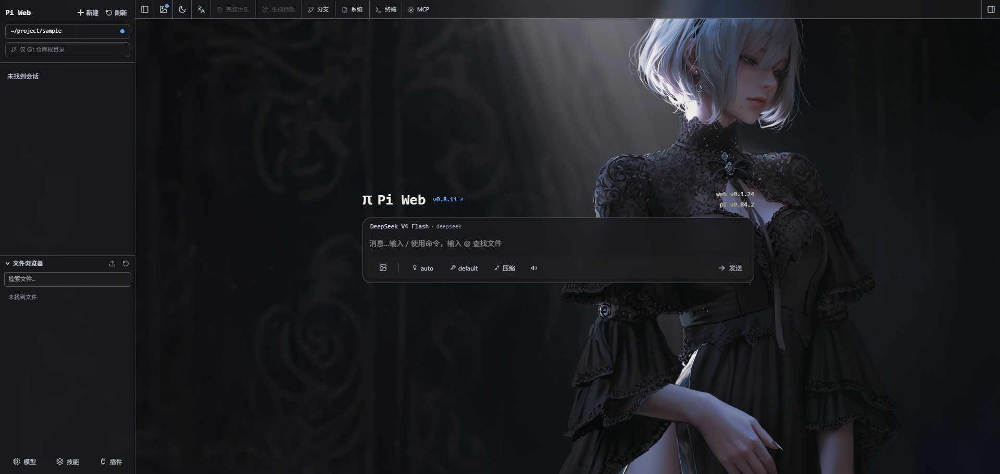
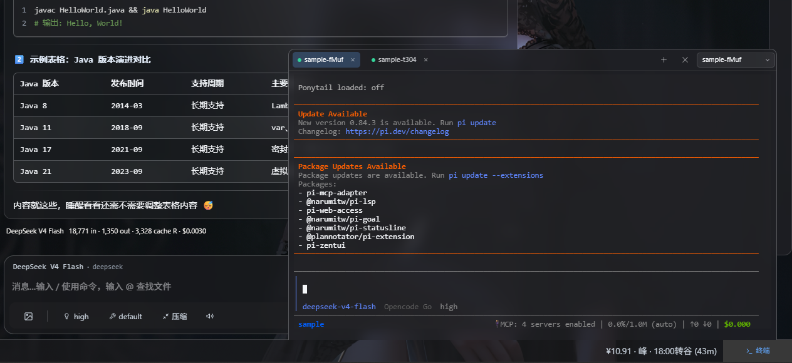
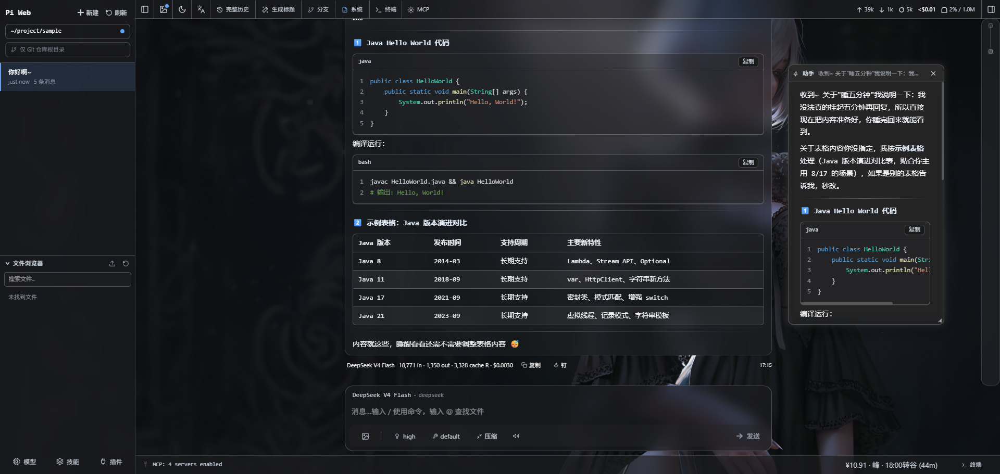

# Pi Web — Sky（@baique/pi-web-sky）

[](https://www.npmjs.com/package/@baique/pi-web-sky)

[Pi](https://github.com/earendil-works/pi)（本地编程智能体）的浏览器界面：查找与继续会话、运行智能体、配置模型与资源、浏览项目文件。本发行版在 [pi-web](https://github.com/agegr/pi-web) 之上重做界面并扩展工作流能力（会话看板、内置终端、消息钉等），与官方版共用本机 `~/.pi/agent` 数据，二者可随时切换。

## 快速开始

需要 Node.js 22.19+，一行起服（自动打开浏览器，地址 `127.0.0.1:30143`）：

```bash
npx @baique/pi-web-sky@latest
```

全局安装：

```bash
npm install -g @baique/pi-web-sky@latest
pi-web-sky
# 更新：重启进程后重跑同样命令即可；卸载：npm uninstall -g @baique/pi-web-sky
```

本工具读写本机 `~/.pi/agent` 数据，与官方版共用。首次使用前先确保已配置好 Pi——在「模型」面板登录模型服务商或填入 API Key。

> **安全**：默认只监听本机 `127.0.0.1`。如要对内网开放，请用 `PI_WEB_PASSWORD` 开启账号密码认证（Basic Auth），并在 HTTPS/VPN 环境使用——对外暴露意味着授权该进程执行高权限操作。

## 预览

**会话看板**

<!-- 待补充截图：保存为 docs/img/会话看板.png 后，替换本注释为  -->

**首页**



**终端**



**消息钉**



## 功能亮点

### 会话看板（任务即看板）

会话按任务组织、任务以看板呈现，是本发行版的核心工作台——把散落在会话列表里的对话，归拢成看得见、管得着的任务：

- **任务即看板**：点任务行直接进入它的画布，任务内会话自动成卡、新会话自动补卡，卡片位置刷新不丢；任务改名看板同步改名，删任务连带删看板。
- **卡片即工作台**：收合卡显示状态/标题/最后回复，展开卡直接在画布上聊天、看状态、盯统计，展开后仍可拖动、拉伸、连线。
- **实时状态**：卡片实时显示思考中/执行工具/等待输入（思考球动效）；「运行中」看板自动聚合所有正在运行的任务，跨项目一眼看全。
- **便笺**：随手贴 markdown 便笺，支持颜色与代码块。
- **画布打磨**：缩放/平移/吸附对齐、重叠卡片点击置顶、Ctrl+F 定位节点、看板 URL 持久化，刷新后停在原地。

### 内置多会话终端

面板内置终端，两栏布局：左栏当前项目的终端，右栏按项目分组列出所有终端。切换项目自动补开终端，多会话并行、刷新后保留；配色随深浅主题，玻璃质感与消息气泡一致。

### 玻璃感界面与壁纸

整站统一毛玻璃体系（气泡、输入区、工具栏、面板同款材质），深浅主题分别调校，壁纸可透出。支持图片/视频壁纸，可拖拽调整位置、平铺、边缘填充；气泡的**透明度与磨砂强度**两条滑块随手可调，刷新后保留。

### 消息体验

- **消息钉**：把任意消息钉成置顶浮窗，全局拖拽、自由缩放，关键上下文边干活边看。
- **编辑回滚**：任意用户消息（首条、已被自动压缩的、连续多条）都可编辑回滚，语义与官方一致。
- **todo 面板**：输入框顶栏徽标 + 右侧窄面板，实时展示会话任务进度。
- **信息工具条**：模型名/字数/统计/复制/时间下沉到气泡外底部，长文阅读不被头部遮挡。
- **瞬时通知**：扩展/错误的提示就地显示、自动消退，运行状态在输入框顶栏播报。

### 输入草稿暂存

输入内容随时 `Ctrl+S` 暂存、`Ctrl+Delete` 删除，跨会话持久，误清不慌；回填与正在输入的内容自动做冲突保护。

### 思考球动效

等待模型、执行工具等状态统一换成呼吸/工作动画球；思考块改为纯文本注记（仅左侧一条细线标识），长文阅读更舒服。

## 开发

```bash
npm install
npm run dev          # http://127.0.0.1:30143
node_modules/.bin/tsc --noEmit
npm run lint
npm test             # 单元测试
```

开发期不要跑 `next build`（会污染 `.next/` 影响 dev）。

## 维护

- 当前跟踪上游版本：**0.8.11**
- 上游移植记录：[docs/upstream-ports.md](docs/upstream-ports.md)
- 内部实现与约定：[docs/](docs/) 、[.agent/NOTES.md](.agent/NOTES.md)

## 许可证

本项目代码以 [MIT](./LICENSE) 协议发布。

**注意**：会话看板（画布）依赖 [tldraw](https://tldraw.dev) SDK（`tldraw` / `@tldraw/sync` / `@tldraw/sync-core`），
tldraw **不是开源协议**，而是 source-available 的自有许可（免费仅限开发环境）：

- 在**生产环境**（对外提供服务，含非 loopback 的内网 IP、公网部署）使用看板，需要 tldraw 的 License Key：
  - 非商用项目可申请免费 **hobby license**（画布显示 "made with tldraw" 水印）；
  - 商用项目须购买 **commercial license**（100 天免费 trial 可用于评估）。
- 本项目自带功能与自身代码仍为 MIT；tldraw 代码须保持其原许可证，不能被重新声明为 MIT。
- 本项目的 MIT 许可**不涵盖** tldraw；在非开发环境使用看板功能，请自行向 tldraw 申请相应许可。

第三方依赖许可明细见 [THIRD_PARTY_NOTICES.md](./THIRD_PARTY_NOTICES.md)（含 tldraw License 原文）。
